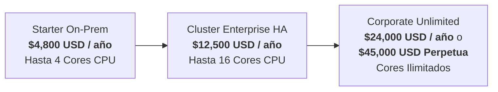

# GMR Reports — Marco Comercial y Técnico de Licenciamiento On-Premise

**Versión:** 2.0  
**Fecha de Publicación:** Septiembre 2026  
**Entidad Emisora:** GMR Solutions (`>> Science in Action`)  
**Contacto Comercial:** `founders@gmresearch.io` | `sales@gmrglobe.com`

---

## 1. Resumen Ejecutivo

El licenciamiento **On-Premise y Self-Hosted** de GMR Reports está diseñado específicamente para instituciones bancarias, financieras, entidades gubernamentales y empresas reguladas que por mandato normativo (GDPR, PCI-DSS, regulaciones bancarias locales) o políticas de seguridad interna no pueden transmitir datos de clientes o transacciones financieras fuera de su perímetro de red.

A diferencia del modelo SaaS en la nube, el licenciamiento On-Premise otorga el derecho de ejecutar las librerías, motores de renderizado nativos y contenedores de GMR Reports directamente dentro de los centros de datos privados o nubes dedicadas del cliente, garantizando **Cero Retención de Datos (ZDR)** y **operación 100% Air-Gapped (sin llamadas telefónicas ni telemetría externa)**.

---

## 2. Componentes de Software Licenciados

El contrato de licenciamiento cubre los siguientes artefactos productivos:

| Componente | Tipo de Entrega | Descripción Técnica |
| :--- | :--- | :--- |
| **`gmr-reports-spring-boot-starter`** | Artefacto Maven / JAR | Starter para Spring Boot 3.x que autoconfigura el motor de reportes en memoria, pooling de plantillas y serializadores de alta velocidad. |
| **`gmr-reports-core`** | Librería Java pura | Núcleo de renderizado que compila y procesa JRXML, XSL-FO y HTML hacia PDF/A, XLSX, CSV y JSON con consumo de memoria L1 ultra-bajo (<35 MB). |
| **`gmr-reports-quarkus`** | Binario Nativo GraalVM | Microservicio empaquetado en binario ELF nativo (Linux x86_64 y ARM64), cold start en ~88 ms y renderizado sub-milisegundo. |
| **Imágenes de Contenedor OCI** | Contenedor Distroless | Imágenes base distroless seguras sin shell ni utilidades innecesarias, con superficie de ataque mínima y CVEs cero. |
| **Helm Charts de Producción** | Manifiestos K8s | Despliegue automatizado para clústeres de alta disponibilidad con réplicas horizontales (HPA), sondas liveness/readiness y sincronización de caché distribuida. |

---

## 3. Tiers de Licenciamiento y Esquema de Precios

La plataforma ofrece tres niveles de licenciamiento On-Premise adaptados al volumen y criticidad de la arquitectura cliente:

### 3.1. Starter On-Prem (Microservicios & Servidor Único)
* **Inversión:** **$4,800 USD / año** (equivalente a \$400/mes facturado anualmente).
* **Métrica de Cómputo:** Hasta **4 CPU Cores** o 1 instancia JVM / Runner Nativo.
* **Características Incluidas:**
  * Uso comercial de `gmr-reports-spring-boot-starter` y binario Quarkus nativo.
  * Generación de PDF/A, compresión nativa y encriptación de documentos AES.
  * Soporte completo para plantillas JRXML y XSL-FO dinámicas.
  * Parches de seguridad y actualizaciones de versiones menores (semver) durante el periodo de suscripción.
  * Soporte técnico estándar por email/ticket (Lunes a Viernes, SLA < 8h).

### 3.2. Cluster Enterprise HA (Kubernetes, OpenShift & Alta Disponibilidad)
* **Inversión:** **$12,500 USD / año** (equivalente a \$1,040/mes facturado anualmente).
* **Métrica de Cómputo:** Hasta **16 CPU Cores** distribuidos en pods o VMs en clúster activo-activo.
* **Características Incluidas:**
  * Todos los beneficios del Starter Tier.
  * Sincronización de clúster distribuido (soporte para Redis Sentinel / Cluster o Hazelcast).
  * Conectores de datos externos JDBC directos (Oracle Database, PostgreSQL, Microsoft SQL Server, IBM DB2).
  * Suite de cifrado mTLS interno para llamadas entre microservicios.
  * Paquete de cumplimiento y auditoría Cero Retención de Datos (ZDR).
  * Soporte técnico prioritario (Lunes a Viernes, SLA de respuesta < 4h).

### 3.3. Corporate Unlimited / Core Banking (Air-Gapped & Misión Crítica)
* **Modalidad Suscripción Anual:** **$24,000 USD / año** con soporte Tier-1 incluido.
* **Modalidad Licencia Perpetua:** **$45,000 USD pago único** (+ 20% anual opcional a partir del año 2 para mantenimiento y actualizaciones).
* **Métrica de Cómputo:** **Nodos y Cores CPU Ilimitados**, incluyendo sitio primario, secundario y contingencia (Disaster Recovery).
* **Características Incluidas:**
  * Todos los beneficios de Cluster Enterprise HA.
  * Módulo de **Firma Digital PAdES con integración a HSM FIPS 140-2 Level 3** (físico o cloud dedicado).
  * **100% Air-Gapped**: Arquitectura certificada sin ninguna llamada externa de validación de licencias o telemetría.
  * Asistencia técnica directa y consultoría de arquitectura por ingenieros sénior de GMR.
  * Código fuente de referencia para auditorías de seguridad e integración con Core Bancario.
  * **SLA 24/7 de Severidad 1 con respuesta garantizada en menos de 1 hora**.

---

## 4. Garantías Técnicas y de Cumplimiento

### 4.1. Operación Estrictamente Air-Gapped (Sin Telemetría)
Las licencias on-premise no utilizan servidores de activación online ni envían métricas a la nube de GMR. La activación se formaliza mediante clave criptográfica RSA/Ed25519 embebida o archivo de licencia firmado digitalmente, garantizando que el software opera de forma autónoma en redes con aislamiento físico total.

### 4.2. Cero Retención de Datos (Zero-Data Retention - ZDR)
Todo el renderizado se efectúa en streaming en la memoria volátil (RAM L1/L2) del proceso. Ni el código fuente de las plantillas con datos en tiempo de ejecución, ni los payloads JSON/XML, ni los PDFs generados se persisten en disco local a menos que la aplicación anfitriona lo ordene explícitamente.

### 4.3. Cifrado Nativo y Protección de Documentos
El motor integra criptografía BouncyCastle para emitir documentos con:
* **Cifrado AES-128 / AES-256 bits** nativo en memoria.
* **Contraseñas de Usuario y Propietario** diferenciadas (`_pdf_user_password`, `_pdf_owner_password`).
* **Permisos granulares de seguridad**: deshabilitar impresión, copia de texto o modificación de formularios según la política corporativa.

---

## 5. Acuerdos de Nivel de Servicio (SLA) de Soporte

| Nivel de Severidad | Definición | SLA Starter | SLA Cluster HA | SLA Corporate Unlimited |
| :--- | :--- | :---: | :---: | :---: |
| **Severidad 1 (Crítica)** | Interrupción total del servicio en producción; pérdida de emisión de facturas o reportes críticos sin solución alternativa. | 8 horas hábiles | 4 horas hábiles | **< 1 hora (24/7)** |
| **Severidad 2 (Alta)** | Degradación significativa del rendimiento o falla de componentes no críticos en producción. | 24 horas | 8 horas hábiles | **< 4 horas** |
| **Severidad 3 (Media)** | Problemas en ambientes de homologación/desarrollo o dudas sobre plantillas y configuración. | 48 horas | 24 horas | **< 12 horas** |

---

## 6. Procedimiento de Adquisición y Piloto de Evaluación

1. **Solicitud de Piloto:** Las organizaciones interesadas pueden solicitar una licencia de evaluación de 30 días sin costo contactando a `founders@gmresearch.io`.
2. **Homologación Técnica:** El equipo de GMR entrega acceso al registro de artefactos privado (Maven / Docker Registry) y plantilla Helm de referencia.
3. **Formalización Contractual:** Tras la homologación técnica, se formaliza la orden de compra y se entrega el paquete de licencia junto con los acuerdos de confidencialidad (NDA) y SLA correspondientes.
